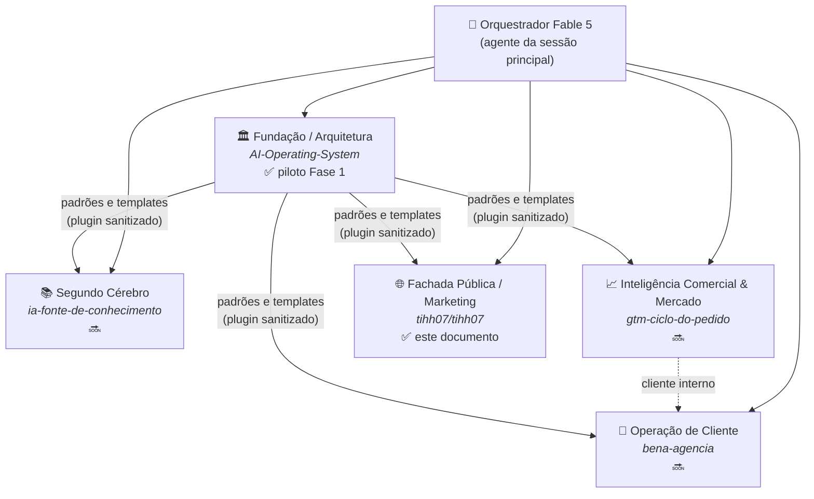

# Blueprint: Ecossistema de Agentes de Orquestração Multi-Repo

> **RFC / Design Doc** — versão 0.1 (Fase 0) · 2026-07-24
> Status: 🔜 nenhuma rotina em produção ainda; este documento É a Fase 0.
> Licença: texto [CC BY 4.0](https://creativecommons.org/licenses/by/4.0/) · snippets de código [MIT](https://opensource.org/licenses/MIT)
>
> *Instância aplicada da metodologia [PromptOps OS](https://promptops-os-brasil.tiagosouza.chatgpt.site/): demandas → entregas com IA, contexto e critérios de qualidade.*

**English summary:** This is a public, sanitized design doc (RFC) for a personal multi-repo agent
orchestration ecosystem built on Claude Code: a Fable 5 orchestrator directing specialized executor
subagents, treating each GitHub repository as a company department, with weekly autonomous routines,
git-committed institutional memory, an explicit governance/risk matrix, honest cost modeling, and a
phased roadmap. Every section is marked ✅ (real today) or 🔜 (roadmap). Written in Brazilian
Portuguese; sources are in English.

**Disclaimers:** conteúdo genérico e sanitizado — nenhum dado de cliente, empregador ou pessoa é
reproduzido aqui. Não é aconselhamento jurídico, de segurança ou de compliance. Claude, Anthropic e
GitHub são marcas de seus titulares, citadas nominativamente, sem qualquer sugestão de endosso.

---

## TL;DR executivo

Cada repositório é um **departamento de uma empresa**. Um **orquestrador Fable 5** (o "cabeça") roda
como agente da sessão principal e delega para **executores especializados** (subagents) com
ferramentas mínimas e memória própria versionada no git. Uma **rotina semanal** (Claude Code
Routines) valida, diagnostica, audita e reporta — começando por um único departamento-piloto, com
tudo passando por PR para revisão humana. O sistema **aprende com os próprios erros** através de um
log de aprendizados com gate humano, e cada componente tem **critério de desligamento** definido —
crescer só depois de provar valor.

Três princípios governam tudo (os mesmos do [perfil](../README.md)): reduzir retrabalho, melhorar a
validação, aumentar a capacidade de execução.

| O quê | Estado |
|---|---|
| Este blueprint (Fase 0) | ✅ publicado |
| Orquestrador + executores no piloto (Fase 1) | 🔜 |
| Rotina semanal em produção (Fase 2) | 🔜 |
| Telemetria OTEL + hooks avançados (Fase 3) | 🔜 |
| Escala multi-departamento / Agent SDK (Fase 4) | 🔜 |

---

## 1. Visão: a empresa de agentes

A analogia é operacional, não decorativa: uma empresa tem **fundação** (princípios e padrões),
**departamentos** (unidades com missão, quadro e rotinas próprias), **governança** (quem aprova o
quê), **finanças** (orçamento e prestação de contas) e **memória institucional** (o que se aprendeu
não se perde). Cada um desses conceitos mapeia para um mecanismo concreto do Claude Code —
documentado na seção 3.

**Quando multi-agente NÃO vale a pena (honestidade econômica).** A própria Anthropic documenta que
um agente consome ~4× os tokens de um chat e um sistema multi-agente ~15×, e que o padrão
orquestrador-executores só compensa em tarefas de alto valor e paralelizáveis ("breadth-first");
para trabalho fortemente acoplado, um agente único é melhor ([multi-agent research
system](https://www.anthropic.com/engineering/multi-agent-research-system), [Building Effective
Agents](https://www.anthropic.com/research/building-effective-agents) — "use the simplest solution
that works"). Por isso este ecossistema **começa pequeno**: 1 departamento-piloto, 1 rotina semanal,
e uma política explícita de quando o orquestrador NÃO delega (seção 5).

**Regra de honestidade.** Toda seção deste documento marca o que é ✅ real hoje e o que é 🔜
roadmap. Na versão 0.1, o sistema descrito ainda não roda — este doc é o projeto executivo, revisado
por 6 pareceres independentes (arquitetura, segurança, negócio, red team adversarial, jurídico/LGPD,
plataforma de dados) antes da publicação.

---

## 2. Como funciona de verdade: a mecânica Anthropic ✅ (fatos verificados)

Fatos conferidos contra a documentação oficial em 2026-07; nenhum identificador abaixo é inventado.

| Mecanismo | O que é | Arquivo/identificador | Papel na "empresa" |
|---|---|---|---|
| **Subagents** | Agentes com contexto isolado, delegados pela sessão principal via routing por `description` | `.claude/agents/*.md` — frontmatter: `name`, `description` (obrigatórios); `model` (`fable`/`opus`/`sonnet`/`haiku` ou ID completo), `tools`, `permissionMode`, `memory`, `maxTurns`, `effort` | Os **funcionários executores** |
| **Skills** | Instruções versionadas carregadas inline ou em fork; invocação `/skill` ou automática | `.claude/skills/<nome>/SKILL.md`; controles `disable-model-invocation`, `user-invocable`, `allowed-tools`, `context: fork` | Os **processos replicáveis** |
| **Hooks** | Interceptadores de ciclo de vida; exit code 2 bloqueia (nos eventos bloqueáveis) | `settings.json` — eventos incl. `SessionStart`, `PreToolUse`, `PostToolUse`, `SubagentStart/Stop`, `PermissionRequest`, `Stop`, `UserPromptSubmit` (30+ no total) | Os **controles internos** |
| **Routines** | Execuções agendadas na nuvem (cron ≥1h, GitHub events, API `/fire`); autônomas, push restrito a branches `claude/*` | claude.ai/code/routines — *research preview* | As **rotinas de trabalho** |
| **Memória** | CLAUDE.md hierárquico (<200 linhas), `.claude/rules/` com `paths:`, `memory: project` por subagent (→ `.claude/agent-memory/`, índice limitado a 200 linhas/25KB) | Auto memory da sessão é *machine-local* — **não existe em runs cloud**; só o que está no git persiste | O **segundo cérebro** |
| **Plugins** | Pacote de agents+skills+hooks+`.mcp.json` distribuível via marketplace | `.claude-plugin/plugin.json`; namespace `/plugin:skill`; para cloud, declarado no `.claude/settings.json` do repo | O **manual corporativo** replicável |
| **Agent SDK** | Biblioteca Python/TS com o harness completo, auto-hospedada | `claude-agent-sdk` / `@anthropic-ai/claude-agent-sdk` | A **infraestrutura própria** (Fase 4) |
| **Agent Teams** | Fan-out experimental de teammates que se comunicam (`SendMessage`) | flag `CLAUDE_CODE_EXPERIMENTAL_AGENT_TEAMS=1` | **Forças-tarefa** (Fase 4) |

**Taxonomia dos padrões** ([Building Effective Agents](https://www.anthropic.com/research/building-effective-agents)),
usada para classificar cada rotina deste ecossistema:

- **Routing** — o orquestrador escolhe o executor certo (é o mecanismo nativo de delegação por `description`);
- **Parallelization** — executores independentes em paralelo (auditoria + validação simultâneas);
- **Orchestrator-workers** — o padrão central deste blueprint;
- **Evaluator-optimizer** — um executor produz, outro critica (usado no gate de qualidade da memória).

Restrições operacionais relevantes (✅ documentadas): Routines é research preview com **cap diário de
runs por conta** (~15/dia no plano Max, 5 no Pro) consumindo a mesma cota da assinatura; intervalo
mínimo de 1h; conectores da conta vêm **todos incluídos por padrão** (devem ser removidos rotina a
rotina); triggers GitHub exigem o Claude GitHub App; runs agem com a identidade do titular da conta.

---

## 3. Organograma: repo → departamento



| Repo | Departamento | Missão |
|---|---|---|
| `AI-Operating-System` (privado) | **Fundação / Arquitetura** | Princípios, padrões, o "sistema operacional"; **departamento-piloto da Fase 1** |
| `ia-fonte-de-conhecimento` (privado) | **Segundo Cérebro** | Base de conhecimento e contexto que alimenta os demais |
| `gtm-ciclo-do-pedido` (privado) | **Inteligência Comercial & Mercado** | Sede do setor de IC (seção 6.1) |
| `bena-agencia` (privado) | **Operação de Cliente / Agência** | Trabalho de cliente real; cliente interno do setor de IC |
| `tihh07/tihh07` (público) | **Fachada Pública / Marketing** | Este blueprint e o control-plane sanitizado |

**Padrão para anexar um novo departamento** (🔜 replicável): criar/adicionar o repo → instalar o
plugin-fundação (templates de agents/skills/rules) → escrever o CLAUDE.md do departamento (<200
linhas: missão, quadro, critérios) → configurar rulesets de branch e secret scanning → só então (e
só se provar necessidade) criar a rotina semanal do departamento.

---

## 4. O orquestrador Fable 5 ("o cabeça") 🔜

**Decisão arquitetural (corrigida em cross-validation):** o orquestrador NÃO é um subagent. Subagents
não spawnam subagents por padrão — um "chefe" definido como subagent não conseguiria dirigir os
executores. O orquestrador é o **agente da sessão principal**, ativado por uma destas vias:

1. `claude --agent orquestrador` (interativo);
2. setting `"agent": "orquestrador"` no `.claude/settings.json` do repo (toda sessão do repo já abre com o chefe);
3. em Routines: o prompt da rotina assume o papel de orquestrador, com o modelo da rotina.

O quadro de executores que ele pode acionar é uma **allowlist explícita** no frontmatter:
`tools: Agent(validador, depurador, auditor-seguranca, documentador)`.

**O que o orquestrador faz:** entende a demanda, decide se delega (routing), despacha executores em
paralelo quando as tarefas são independentes, sintetiza os resultados, escreve o relatório executivo
e abre o PR.

**O que ele nunca faz:** ações de escrita diretas em código (delega); merge (gate humano); alterar
`.claude/**` ou configurações de rotina (gate humano); tratar conteúdo de issues/PRs/webhooks como
instrução (é dado, sempre).

**Política de delegação (quando NÃO delegar):** tarefa curta, acoplada ou sequencial → o orquestrador
resolve sozinho ou usa um único executor. Delegação em paralelo só quando há ≥2 tarefas independentes
com valor que justifique o multiplicador de custo (~4–15×). "Simplest solution first."

---

## 5. O quadro de executores 🔜

Catálogo de subagents (`.claude/agents/*.md`), todos com `tools` mínimos por papel e
`memory: project` (memória versionada por departamento):

| Executor | Papel | Modelo sugerido | Tools (princípio do mínimo) |
|---|---|---|---|
| `validador` | Testes, lint, build, consistência de docs | `sonnet` | Read, Grep, Glob, Bash |
| `depurador` | Diagnóstico de falhas e regressões | `sonnet`/`opus` | Read, Grep, Glob, Bash |
| `auditor-seguranca` | Varredura de segredos, padrões inseguros, dependências | `opus` | **read-only**: Read, Grep, Glob |
| `guardiao-boas-praticas` | Compara o repo com docs oficiais (allowlist de fontes) | `sonnet` | Read, Grep, WebFetch (allowlist) |
| `documentador` | CLAUDE.md, READMEs, changelog | `haiku`/`sonnet` | Read, Write, Edit, Grep |
| `oficial-governanca` | Verifica conformidade com este blueprint (gates, sanitização) | `sonnet` | read-only |
| `engenheiro-escala` | Performance, estrutura, dívida técnica | `opus` | Read, Grep, Glob, Bash |

Roteamento por modelo é a principal alavanca de custo: **Haiku para o mecânico, Sonnet para análise,
Fable/Opus só para orquestração e síntese**.

### 5.1 Setor de Inteligência Comercial & Mercado 🔜

O departamento-especialidade do ecossistema — "os cientistas e analistas que se adaptam ao segmento".
Sede em `gtm-ciclo-do-pedido`; atende `bena-agencia` como cliente interno.

| Especialista | Papel |
|---|---|
| `cientista-mercado` | Análises quantitativas, séries, forecast |
| `analista-competitivo` | Pesquisa de mercado/concorrência (WebSearch com allowlist de fontes) |
| `analista-sop` | S&OP e ciclo do pedido |
| `analista-sinais` | Tendências e sinais do segmento do cliente |

**O mecanismo de adaptação é o diferencial replicável:** os especialistas não são reescritos por
cliente — eles carregam **contexto versionado por segmento**: um arquivo de briefing do segmento +
`.claude/rules/` com `paths:` + a memória (`memory: project`) acumulada naquele contexto. Novo
cliente/segmento = novo briefing, mesmo quadro. Saída-padrão: relatório executivo (o formato de
comunicação executiva é o produto-assinatura da metodologia).

**Governança reforçada:** é o setor que toca dados comerciais sensíveis e potencialmente dados
pessoais — aplica com rigor máximo a regra R1 (seção 8) e as condições LGPD; qualquer saída pública
é agregada e sanitizada.

---

## 6. Rotinas: começando por UMA 🔜

**Decisão de dimensionamento:** o ecossistema é pequeno — a Fase 2 começa com **uma única rotina
semanal** no departamento-piloto (`AI-Operating-System`), consolidando num só run: validação +
diagnóstico + auditoria de segurança + relatório executivo. Isso cabe folgado no cap de runs
(~4–5/mês vs. teto de ~15/dia), gera ~1 PR/semana para revisão (≤30–60 min de atenção humana) e
respeita "validar antes de escalar".

**Padrão prompt-ponteiro → skill versionada** (anti-drift): o prompt na UI da Routine é apenas
"Execute a skill `/rotina-semanal` conforme `.claude/skills/rotina-semanal/SKILL.md` e registre
telemetria conforme `telemetry/README.md`". Todo o conteúdo real vive na skill, commitada,
revisável por PR; o hash do SKILL.md (`prompt_version`) é registrado em cada run.

**Template de rotina** (campos obrigatórios — limite de blast radius):

| Campo | Regra padrão |
|---|---|
| Repos no escopo | Mínimo necessário; **nunca** privados + público na mesma rotina |
| Conectores | **Zero** (remover todos; adicionar só o estritamente necessário) |
| Network access | Trusted ou Custom (allowlist); nunca Full |
| Branch | Só `claude/*` (nunca habilitar push irrestrito) |
| Saída | **Relatório-first**: PR só quando há mudança proposta |
| Critério de sucesso | Verificável e escrito no prompt (status verde da run ≠ tarefa cumprida — literal na doc oficial) |
| Tier | P1 (nunca pausa) / P2 / P3 (pausa primeiro em aperto de cota) |
| **Sunset** | Outputs sem valor aceito por 3 semanas → rotina desligada |

**Catálogo futuro (🔜, ativado um a um conforme a primeira provar valor):** rotina semanal por
departamento; varredura de segredos; curadoria mensal de memória; briefing de mercado do setor de IC;
rotina-auditora que consolida os PRs pendentes num único relatório semanal.

**Agnosticismo de mecanismo (R11):** Routines é research preview. O desenho acima independe do
agendador — se caps/preços/existência mudarem, as rotinas migram para GitHub Actions (cron) +
Agent SDK com API key, sem redesenho.

---

## 7. Segundo cérebro: memória institucional com gate de qualidade 🔜

**Fato decisivo (verificado):** a memória automática do Claude Code é local da máquina e **não existe
em execuções cloud**. Logo, o segundo cérebro deste ecossistema é 100% **git-committed**:

| Camada | Mecanismo | Quando carrega | Limite duro |
|---|---|---|---|
| Identidade do departamento | `CLAUDE.md` | Sempre | <200 linhas |
| Normas por área | `.claude/rules/*.md` com `paths:` | Quando arquivos correspondentes são tocados | teto ~3k tokens de contexto fixo/departamento |
| Processos | `.claude/skills/` | On-demand | — |
| Memória por executor | `memory: project` → `.claude/agent-memory/<agente>/` | Na ativação do executor | índice MEMORY.md: 200 linhas/25KB (excedente é **descartado silenciosamente**) |
| Log de aprendizados | `AGENTLOG.jsonl` | Consultado pela rotina | 1 linha/aprendizado, ≤280 chars |

**Schema do AGENTLOG** (JSONL): `{ts, agent, routine_id, session_url, tipo:
fato|decisão|erro-corrigido|preferência, conteudo, evidencia, status: proposto|validado|obsoleto,
validated_by}`.

**Gate humano inegociável:** todo aprendizado nasce `proposto`; **só o humano promove a `validado`**.
Sem isso, prompt injection e alucinação virariam "conhecimento institucional" permanente.

### 7.1 Ciclo de aprendizado com erro (o sistema não repete o que errou)

```
erro detectado ──► registro obrigatório ──► validação ──► incorporação ──► não-repetição
(PR rejeitado/       no AGENTLOG              humana        à memória do      (contexto carregado
alterado; outcome    tipo: erro-corrigido                   executor e/ou     em toda sessão
fail/partial;        + evidência (PR/commit                 às rules          seguinte)
correção humana)     da correção)
```

A rotina semanal inclui um passo de **auto-retrospectiva**: antes de finalizar, o orquestrador compara
os erros da run com o AGENTLOG — se um erro já `validado` se repetiu, isso é registrado como falha do
próprio mecanismo de aprendizado. Métrica associada: **taxa de reincidência de erros validados —
meta: zero** (seção 11).

**Curadoria** (rotina mensal, sempre via PR, nunca auto-merge): mescla duplicatas, marca `obsoleto` o
que contradiz o estado atual, verifica limites de tamanho.

**Replicação entre departamentos:** um **plugin-fundação** (repo-marketplace com
`.claude-plugin/marketplace.json`, declarado no `.claude/settings.json` de cada repo) distribui
templates de agents, skills e rules. **Regra anti-vazamento:** o plugin contém apenas templates
genéricos — a memória (`agent-memory`) dos repos privados **nunca** é fonte do plugin; o pipeline do
plugin passa pela mesma checklist de sanitização da seção 8.

---

## 8. Governabilidade 🔜 (desenho) / ✅ (aplicada a este documento)

A governança tem dois regimes distintos — confundi-los foi um dos erros corrigidos em validação:

**Local (sessões interativas):** hooks em `settings.json` — `PreToolUse` bloqueando push fora de
`claude/*`, force-push, merge por agente e escrita em `.claude/**`/`.mcp.json`; `PostToolUse`
registrando ações de escrita em log versionado.

**Cloud (Routines):** não há prompts de permissão em runs autônomas — o controle real é a
configuração: conectores zero, network restrito, push só `claude/*`, escopo mínimo de repos, e o PR
como gate universal de saída.

### Matriz de riscos (R1–R11)

| # | Risco | Mitigação de desenho |
|---|---|---|
| R1 | Vazamento privado→público | **Nenhuma sessão mistura repos privados e o público**; publicação sempre via PR + checklist de sanitização + revisão humana |
| R2 | Prompt injection via issues/PRs/webhooks (ataques reais documentados: [GitLost](https://noma.security/blog/gitlost-how-we-tricked-githubs-ai-agent-into-leaking-private-repos/), [PromptPwnd](https://www.aikido.dev/blog/promptpwnd-github-actions-ai-agents)) | Conteúdo de terceiros = dado, nunca instrução; filtros de trigger por autor/label; preferir schedule a evento no repo público |
| R3 | Sessão cloud acessa qualquer repo visível à conta (limitação documentada) | Assumida; push restrito `claude/*` + rulesets em `main` dos 5 repos |
| R4 | Excessive agency das Routines (autônomas, conectores default-on) | Conectores ZERO por rotina; executores read-only onde couber |
| R5 | Supply chain do control-plane (`.claude/`, `.mcp.json` auto-carregados) | CODEOWNERS em `.claude/**`, `.mcp.json`, `.github/**`; PR obrigatório sem bypass de admin |
| R6 | Segredos (sem secrets store em ambientes cloud) | Nenhuma credencial de terceiros em rotinas; secret scanning + push protection nos 5 repos |
| R7 | Auditabilidade (agente age com a identidade do titular) | Footer de atribuição + `Co-Authored-By` em todo commit; branches `claude/*`; revisão semanal de transcripts |
| R8 | Cadeia orquestrador→executor (routing por description é injetável) | Orquestrador não escreve, só delega; tools mínimos; um repo = um contexto |
| R9 | Consumo disparado por terceiros (triggers no repo público) | Filtros de autor; schedule em vez de evento |
| R10 | Canal residual de exfiltração (VM fala com a API mesmo em network None) | Risco residual aceito e documentado; compensado por R1/R2 |
| R11 | Dependência de research preview | Desenho agnóstico ao agendador; migração definida (GitHub Actions + Agent SDK) |

### Gates humanos (por classe de ação)

| Sem gate | Gate humano obrigatório |
|---|---|
| Leitura, análise, relatório em `claude/*` | Merge em `main` de qualquer repo |
| Abrir PR | Qualquer commit no repo público |
| Registrar aprendizado como `proposto` | Promover aprendizado a `validado` |
| — | Alterar `.claude/**`, `.mcp.json`, workflows |
| — | Criar/editar rotinas; adicionar conectores; mudar network access |

### Checklist de sanitização (aplicada a todo conteúdo destinado ao público — inclusive este doc ✅)

Sem nomes de clientes/empregador · sem dados pessoais de qualquer titular · sem métricas comerciais
reais · sem paths/URLs internos · sem trechos literais de repos privados · sem prompts que revelem
processo proprietário · sem transcripts de sessões privadas · custos apenas como cenários.

### Kill-switch (3 níveis) e runbook

1. **Pausar** a rotina (toggle) — segundos;
2. **Deletar** a rotina — minutos;
3. **Revogar** o Claude GitHub App / desconectar a conta — corta tudo.

Runbook de incidente: pausar rotinas → revogar App/tokens → auditar sessions e branches `claude/*` →
rotacionar segredos → revisar histórico do repo público (incl. reescrita se algo vazou).

### Condições jurídicas (LGPD, proporcional a agente de pequeno porte)

*Não é aconselhamento jurídico.* Antes da Fase 1: opt-out de treinamento confirmado na conta (com
evidência datada); titularidade dos dados de cada repo verificada (dados de empregador/cliente não
pertencem a repo pessoal). Antes da Fase 2 (**regra dura**): repos lidos por rotinas não contêm dados
pessoais brutos nem confidenciais de terceiros — sanitização/pseudonimização **na origem** ou
exclusão do escopo (EUA sem decisão de adequação da ANPD; a defesa realista é minimização); ciência
dos clientes por escrito; registro simplificado de operações (Res. ANPD 2/2022). Se dados pessoais
reais se tornarem necessários: migrar antes para plano comercial/API (com DPA).

### Enquadramento NIST AI RMF (proporcional)

**Govern:** dono = o titular; política = este documento. **Map:** inventário vivo de rotinas/agentes
com escopo e tier. **Measure:** telemetria (seção 10) + revisão semanal de runs. **Manage:** matriz
R1–R11 viva + runbook + re-validação do blueprint a cada fase.

---

## 9. CFO: custo com honestidade 🔜

**Decisão de arquitetura financeira:** operar via **assinatura (plano Max)** — custo fixo mensal —
em vez de API (variável). Com transparência sobre o que "flat" significa: teto de ~15 runs de
rotina/dia consumindo a **mesma cota** do uso interativo; acima disso, bloqueio até o reset ou
overage cobrado à parte. **Usage credits ficam desligados** — o sistema parar é o kill-switch
financeiro natural; gastar sem teto não é.

Referência de API (regime alternativo, por 1M tokens — preços oficiais 2026): Fable 5 $10/$50 ·
Opus 4.8 $5/$25 · Sonnet 5 $3/$15 · Haiku 4.5 $1/$5; Batch −50%; cache read ≈0,1× do input. Cenário
de referência: com roteamento por modelo e cadência semanal, a ordem de grandeza via API ficaria em
dezenas de dólares/mês; tudo-Fable em cadência diária passaria de mil — é por isso que roteamento e
cadência são as alavancas nº 1 e nº 2.

**Alavancas de economia (ordem de impacto):** (1) assinatura vs. API; (2) roteamento por modelo
(Haiku→Sonnet→Fable); (3) cadência semanal (não diária); (4) prompt cache (prefixos estáveis);
(5) Batch API para pipelines fora das Routines.

**Custo por entrega:** número declarado como **não mensurável hoje** em regime de assinatura (não há
fatura por run) — nenhuma cifra será publicada até haver medição real (via API/OTEL, Fase 3).
Honestidade > número inventado.

**Degradação de cota:** rotinas com tiers P1–P3; se >70% da cota consumida antes do dia 20 do mês,
P3 pausa primeiro.

---

## 10. Telemetria: só o que é capturável de verdade 🔜

O que o regime de assinatura **não** oferece: custo em dólares por run, API de uso programática.
O pipeline abaixo usa apenas o que existe:

1. **Nascimento do dado:** toda rotina termina anexando 1 linha a `telemetry/runs.jsonl`:
   `{ts, routine_id, session_id, repo, model, prompt_version, outcome: success|partial|fail
   (auto-avaliado contra o critério escrito no prompt), duration, pr_url, files_changed,
   tokens|null}`. O `session_id` vem de `CLAUDE_CODE_REMOTE_SESSION_ID` — a chave primária que liga
   run ↔ commit ↔ PR ↔ telemetria.
2. **Reconciliação:** 1×/semana, snapshot manual do consumo da conta → `telemetry/usage-snapshots.csv`
   (~2 min). É o único número "de verdade" no regime de assinatura.
3. **Dashboard:** GitHub Actions (cron) gera `telemetry/dashboard.html` commitado — a vitrine de BI
   do próprio sistema.
4. **Watchdog independente** (GitHub Actions, deliberadamente fora do ecossistema Claude — não
   compartilha modo de falha): detecta rotina morta (>26h sem registro), PR `claude/*` parado >7
   dias, MEMORY.md acima do limite → e-mail nativo do GitHub. ~30 linhas de YAML; item obrigatório
   da Fase 1.
5. **Fase 3:** OpenTelemetry do Claude Code (`claude_code.token.usage`, `claude_code.cost.usage`)
   com collector próprio — aí sim custo real por request.

---

## 11. COO: métricas e o recurso mais escasso 🔜

Todas as métricas mapeiam para os 3 princípios do [perfil](../README.md):

| Princípio | Métrica | Fonte |
|---|---|---|
| Reduzir retrabalho | Rework/churn dos outputs de rotina; **taxa de reincidência de erros validados (meta: zero)** | AGENTLOG + PRs |
| Melhorar validação | Lead time detecção→correção; % de runs com `outcome=success` real | runs.jsonl |
| Aumentar capacidade de execução | Cobertura de rotina (departamentos com run verde nos últimos 7 dias); entregas aceitas | runs.jsonl + PRs |

Métrica deliberadamente **ausente**: "% de PRs aceitos sem alteração" — induz revisão-carimbo, que
anularia o gate humano que sustenta toda a matriz de riscos.

**O recurso mais escasso é a atenção do revisor humano** (declarado, não escondido): ~30–60 min/sem
com 1 rotina; 3–5 h/sem se escalar para 5 departamentos sem automatizar a consolidação. Regra de
corte: rotina que consome mais tempo de revisão do que economiza, por 3 semanas, é desligada
(sunset). Automatizar primeiro: watchdog → dashboard → rotina-auditora que consolida N revisões em
1 leitura.

**Critérios de sucesso por fase** (o roadmap é auditável):

| Fase | Critério de saída |
|---|---|
| 0 (este doc) | Publicado, com todas as condições das 6 bancas incorporadas ✅ |
| 1 | Piloto operando: orquestrador + 3–4 executores + watchdog ativo; pré-condições jurídicas cumpridas |
| 2 | Rotina semanal com ≥4 runs consecutivas com `outcome=success` real e valor aceito em revisão |
| 3 | Telemetria de custo real por run; hooks avançados ativos |
| 4 | ≥2 departamentos adicionais operando com o mesmo processo replicado, dentro do orçamento de atenção |

---

## 12. Roadmap

- **Fase 0 — Fundação documental** ✅: este RFC, validado por 6 pareceres (arquitetura, CISO,
  CFO/CMO/COO, red team, jurídico/LGPD, plataforma de dados) em 2 rodadas de cross-validation.
- **Fase 1 — Piloto** 🔜 (`AI-Operating-System`): plugin-fundação; orquestrador (`claude --agent`);
  3–4 executores com `memory: project`; hooks de guardrail; watchdog; rulesets + CODEOWNERS +
  secret scanning nos 5 repos; opt-out de treinamento confirmado.
- **Fase 2 — Primeira rotina** 🔜: 1 rotina semanal (prompt-ponteiro → skill); telemetria
  runs.jsonl; pré-condições LGPD cumpridas; 4 semanas de prova de valor.
- **Fase 3 — Profundidade** 🔜: telemetria OTEL com custo real; hooks avançados (`type: prompt`/
  `agent`, redação de segredos); dashboard automatizado; rotina de curadoria de memória.
- **Fase 4 — Escala** 🔜: replicação departamento a departamento (só com valor provado); setor de
  Inteligência Comercial com briefings por segmento; avaliação de Agent SDK / Managed Agents
  (scheduled deployments) / Agent Teams para cargas que o modelo de Routines não cobre.

---

## Apêndice A — Snippets de referência (🔜 não executados; ilustrativos)

**Executor com memória e tools mínimos** (`.claude/agents/auditor-seguranca.md`):

```yaml
---
name: auditor-seguranca
description: Auditoria read-only de segredos, padrões inseguros e dependências. Usar proativamente em toda validação semanal.
model: opus
tools: Read, Grep, Glob
memory: project
---
Você é o auditor de segurança do departamento. Nunca modifica arquivos.
Antes de concluir, consulte sua memória e o AGENTLOG: não repita falsos
positivos já descartados nem deixe de reportar padrões de erro já validados.
Saída: relatório estruturado com severidade e evidência (path:linha).
```

**Orquestrador como agente da sessão principal** (`.claude/agents/orquestrador.md` + setting):

```yaml
---
name: orquestrador
description: Dirige o departamento. Roteia trabalho para os executores certos e sintetiza o relatório executivo.
model: fable
tools: Read, Grep, Glob, Agent(validador, depurador, auditor-seguranca, documentador)
---
```

```json
// .claude/settings.json do repo-departamento
{ "agent": "orquestrador" }
```

**Hook de guardrail — bloqueia push fora de claude/*** (`.claude/settings.json`):

```json
{
  "hooks": {
    "PreToolUse": [{
      "matcher": "Bash",
      "hooks": [{ "type": "command", "command": ".claude/hooks/guard-push.sh" }]
    }]
  }
}
```

```bash
#!/bin/bash
# .claude/hooks/guard-push.sh — exit 2 bloqueia a ação
INPUT=$(cat); CMD=$(echo "$INPUT" | jq -r '.tool_input.command // empty')
if echo "$CMD" | grep -qE 'git push' && ! echo "$CMD" | grep -qE 'claude/'; then
  echo "Push permitido apenas em branches claude/*" >&2; exit 2
fi
exit 0
```

**Linha de telemetria** (`telemetry/runs.jsonl`):

```json
{"ts":"2026-08-01T09:00:00Z","routine_id":"rotina-semanal-fundacao","session_id":"<CLAUDE_CODE_REMOTE_SESSION_ID>","repo":"AI-Operating-System","model":"fable","prompt_version":"a1b2c3d","outcome":"success","duration_s":540,"pr_url":"…","files_changed":3,"tokens":null}
```

**Entrada de aprendizado** (`AGENTLOG.jsonl`):

```json
{"ts":"2026-08-01T09:05:00Z","agent":"validador","routine_id":"rotina-semanal-fundacao","tipo":"erro-corrigido","conteudo":"Falso positivo recorrente em links relativos de docs — validar contra a raiz do repo, não do arquivo","evidencia":"PR #12","status":"proposto","validated_by":null}
```

## Apêndice B — Limites operacionais assumidos (Routines, research preview, 2026-07)

Intervalo mínimo 1h · cap diário de runs por conta (~15 no Max, 5 no Pro), consumindo a cota da
assinatura · conectores da conta incluídos por padrão (remover por rotina) · push restrito a
`claude/*` (manter) · sem secrets store no ambiente cloud · runs agem com a identidade do titular ·
status verde ≠ tarefa cumprida · triggers GitHub exigem o Claude GitHub App · prompts armazenados na
UI (por isso o padrão prompt-ponteiro) · tudo sujeito a mudança (ver R11).

## Apêndice C — Fontes

**Anthropic (oficiais):**
[Subagents](https://code.claude.com/docs/en/sub-agents) ·
[Skills](https://code.claude.com/docs/en/skills) ·
[Hooks](https://code.claude.com/docs/en/hooks) ·
[Routines](https://code.claude.com/docs/en/routines) ·
[Memory](https://code.claude.com/docs/en/memory) ·
[Plugins](https://code.claude.com/docs/en/plugins-reference) ·
[Claude Code on the web](https://code.claude.com/docs/en/claude-code-on-the-web) ·
[Security](https://code.claude.com/docs/en/security) ·
[Monitoring/OTEL](https://code.claude.com/docs/en/monitoring-usage) ·
[Costs](https://code.claude.com/docs/en/costs) ·
[Agent Teams](https://code.claude.com/docs/en/agent-teams) ·
[Agent SDK](https://code.claude.com/docs/en/agent-sdk/overview) ·
[Building Effective Agents](https://www.anthropic.com/research/building-effective-agents) ·
[Multi-agent research system](https://www.anthropic.com/engineering/multi-agent-research-system) ·
[Consumer Terms & treinamento](https://www.anthropic.com/news/updates-to-our-consumer-terms)

**Segurança:**
[OWASP Top 10 for LLM Applications 2025](https://genai.owasp.org/resource/owasp-top-10-for-llm-applications-2025/) ·
[OWASP Agentic AI Threats & Mitigations](https://genai.owasp.org/resource/agentic-ai-threats-and-mitigations/) ·
[OWASP Top 10 for Agentic Applications 2026](https://genai.owasp.org/resource/owasp-top-10-for-agentic-applications-for-2026/) ·
[NIST AI RMF](https://www.nist.gov/itl/ai-risk-management-framework) ·
[Caso GitLost](https://noma.security/blog/gitlost-how-we-tricked-githubs-ai-agent-into-leaking-private-repos/) ·
[Caso PromptPwnd](https://www.aikido.dev/blog/promptpwnd-github-actions-ai-agents) ·
[GitHub branch protection](https://docs.github.com/en/repositories/configuring-branches-and-merges-in-your-repository/managing-protected-branches/managing-a-branch-protection-rule)

**Jurídico (Brasil):**
[ANPD — transferência internacional](https://www.gov.br/anpd/pt-br/assuntos/assuntos-internacionais/transferencia-internacional-de-dados) ·
[Res. CD/ANPD nº 2/2022 (pequeno porte)](https://www.gov.br/anpd/pt-br/acesso-a-informacao/institucional/atos-normativos/regulamentacoes_anpd/resolucao-cd-anpd-no-2-de-27-de-janeiro-de-2022) ·
[GitHub ToS](https://docs.github.com/en/site-policy/github-terms/github-terms-of-service)

**Gestão e métricas:**
[FinOps Foundation — Token Economics](https://www.finops.org/wg/token-economics-saas/) ·
[DORA metrics](https://getdx.com/blog/dora-metrics/)

---

*Documento gerado e validado com Claude Code — 6 pareceres de agentes revisores em 2 rodadas de
cross-validation, com decisões humanas registradas em entrevista. O processo de produção deste
documento é, ele próprio, uma demonstração do padrão orquestrador-executores que ele descreve.*
